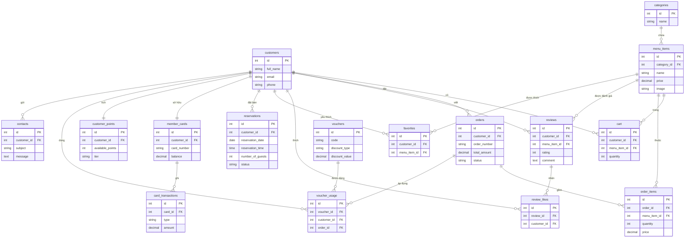

# ERD - Ngon Gallery Restaurant

## 1. Mô hình Người dùng (Customer)

---

## 2. Mô hình Quản trị viên (Admin)

---

## Tổng quan hệ thống

| Phía | Chức năng chính |
|------|-----------------|
| **Customer** | Xem menu, đặt hàng, giỏ hàng, đánh giá, yêu thích, đặt bàn, thẻ thành viên, voucher, tích điểm, liên hệ |
| **Admin** | Quản lý menu, đơn hàng, đặt bàn, bàn ăn, voucher, thẻ thành viên, nạp tiền, trả lời liên hệ, cài đặt điểm |
