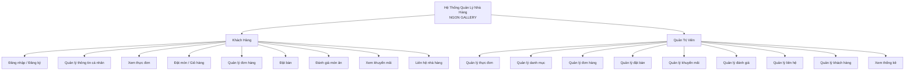

# 1.1.1 Thiết kế xử lý

## 1.1.1.1 Sơ đồ phân cấp chức năng

*Hình 9: Sơ đồ phân cấp chức năng hệ thống*

---

## 1.1.1.2 Chi tiết các chức năng

### A. Chức năng phía Khách Hàng

| STT | Chức năng | Mô tả |
|-----|-----------|-------|
| 1 | Đăng nhập / Đăng ký | Khách hàng đăng ký tài khoản mới hoặc đăng nhập vào hệ thống. Hỗ trợ đăng nhập bằng Google. |
| 2 | Quản lý thông tin cá nhân | Xem và cập nhật thông tin cá nhân: họ tên, email, số điện thoại, địa chỉ, ảnh đại diện. |
| 3 | Xem thực đơn | Xem danh sách món ăn theo danh mục, tìm kiếm món ăn, xem chi tiết món ăn. |
| 4 | Đặt món / Giỏ hàng | Thêm món vào giỏ hàng, cập nhật số lượng, xóa món, áp dụng mã khuyến mãi, thanh toán. |
| 5 | Quản lý đơn hàng | Xem danh sách đơn hàng, theo dõi trạng thái đơn hàng, xem chi tiết đơn hàng, in hóa đơn. |
| 6 | Đặt bàn | Đặt bàn trước, chọn ngày giờ, số lượng khách, yêu cầu đặc biệt, xem lịch sử đặt bàn. |
| 7 | Đánh giá món ăn | Viết đánh giá cho món ăn đã đặt, chấm điểm sao, thích đánh giá của người khác. |
| 8 | Xem khuyến mãi | Xem các chương trình khuyến mãi hiện có, lưu mã khuyến mãi để sử dụng sau. |
| 9 | Liên hệ nhà hàng | Gửi tin nhắn liên hệ đến nhà hàng, xem phản hồi từ admin. |

### B. Chức năng phía Quản Trị Viên

| STT | Chức năng | Mô tả |
|-----|-----------|-------|
| 1 | Quản lý thực đơn | Thêm, sửa, xóa món ăn. Cập nhật giá, hình ảnh, trạng thái còn/hết món. |
| 2 | Quản lý danh mục | Thêm, sửa, xóa danh mục món ăn. Sắp xếp thứ tự hiển thị. |
| 3 | Quản lý đơn hàng | Xem danh sách đơn hàng, cập nhật trạng thái đơn hàng, xem chi tiết đơn hàng. |
| 4 | Quản lý đặt bàn | Xem danh sách đặt bàn, xác nhận/hủy đặt bàn, ghi chú cho đặt bàn. |
| 5 | Quản lý khuyến mãi | Tạo mã khuyến mãi mới, cập nhật thông tin khuyến mãi, bật/tắt khuyến mãi. |
| 6 | Quản lý đánh giá | Xem danh sách đánh giá, duyệt/ẩn đánh giá, xóa đánh giá vi phạm. |
| 7 | Quản lý liên hệ | Xem tin nhắn liên hệ từ khách hàng, phản hồi tin nhắn. |
| 8 | Quản lý khách hàng | Xem danh sách khách hàng, xem thông tin chi tiết khách hàng. |
| 9 | Xem thống kê | Xem thống kê doanh thu, đơn hàng, món ăn bán chạy, khách hàng. |

---

## 1.1.1.3 Sơ đồ chi tiết chức năng Khách Hàng

```mermaid
graph TD
    KH[Khách Hàng] --> KH1[Đăng nhập / Đăng ký]
    KH --> KH2[Quản lý thông tin cá nhân]
    KH --> KH3[Xem thực đơn]
    KH --> KH4[Đặt món / Giỏ hàng]
    KH --> KH5[Quản lý đơn hàng]
    KH --> KH6[Đặt bàn]
    KH --> KH7[Đánh giá món ăn]
    KH --> KH8[Xem khuyến mãi]
    KH --> KH9[Liên hệ nhà hàng]

    KH1 --> KH1a[Đăng ký tài khoản]
    KH1 --> KH1b[Đăng nhập email/mật khẩu]
    KH1 --> KH1c[Đăng nhập Google]
    KH1 --> KH1d[Quên mật khẩu]

    KH2 --> KH2a[Xem thông tin]
    KH2 --> KH2b[Cập nhật thông tin]
    KH2 --> KH2c[Đổi mật khẩu]
    KH2 --> KH2d[Cập nhật ảnh đại diện]

    KH3 --> KH3a[Xem theo danh mục]
    KH3 --> KH3b[Tìm kiếm món ăn]
    KH3 --> KH3c[Xem chi tiết món]
    KH3 --> KH3d[Xem đánh giá món]

    KH4 --> KH4a[Thêm món vào giỏ]
    KH4 --> KH4b[Cập nhật số lượng]
    KH4 --> KH4c[Xóa món khỏi giỏ]
    KH4 --> KH4d[Áp dụng mã giảm giá]
    KH4 --> KH4e[Thanh toán]

    KH5 --> KH5a[Xem danh sách đơn hàng]
    KH5 --> KH5b[Xem chi tiết đơn hàng]
    KH5 --> KH5c[Theo dõi trạng thái]
    KH5 --> KH5d[In hóa đơn]

    KH6 --> KH6a[Đặt bàn mới]
    KH6 --> KH6b[Xem lịch sử đặt bàn]
    KH6 --> KH6c[Hủy đặt bàn]

    KH7 --> KH7a[Viết đánh giá]
    KH7 --> KH7b[Chấm điểm sao]
    KH7 --> KH7c[Thích đánh giá]
    KH7 --> KH7d[Xem tất cả đánh giá]

    KH8 --> KH8a[Xem danh sách khuyến mãi]
    KH8 --> KH8b[Lưu mã khuyến mãi]
    KH8 --> KH8c[Xem chi tiết khuyến mãi]

    KH9 --> KH9a[Gửi tin nhắn liên hệ]
    KH9 --> KH9b[Xem phản hồi]
```

*Hình 10: Sơ đồ chi tiết chức năng Khách Hàng*

---

## 1.1.1.4 Sơ đồ chi tiết chức năng Quản Trị Viên

```mermaid
graph TD
    AD[Quản Trị Viên] --> AD1[Quản lý thực đơn]
    AD --> AD2[Quản lý danh mục]
    AD --> AD3[Quản lý đơn hàng]
    AD --> AD4[Quản lý đặt bàn]
    AD --> AD5[Quản lý khuyến mãi]
    AD --> AD6[Quản lý đánh giá]
    AD --> AD7[Quản lý liên hệ]
    AD --> AD8[Quản lý khách hàng]
    AD --> AD9[Xem thống kê]

    AD1 --> AD1a[Xem danh sách món ăn]
    AD1 --> AD1b[Thêm món ăn mới]
    AD1 --> AD1c[Sửa thông tin món ăn]
    AD1 --> AD1d[Xóa món ăn]
    AD1 --> AD1e[Cập nhật trạng thái]

    AD2 --> AD2a[Xem danh sách danh mục]
    AD2 --> AD2b[Thêm danh mục mới]
    AD2 --> AD2c[Sửa danh mục]
    AD2 --> AD2d[Xóa danh mục]
    AD2 --> AD2e[Sắp xếp thứ tự]

    AD3 --> AD3a[Xem danh sách đơn hàng]
    AD3 --> AD3b[Xem chi tiết đơn hàng]
    AD3 --> AD3c[Cập nhật trạng thái]
    AD3 --> AD3d[In hóa đơn]

    AD4 --> AD4a[Xem danh sách đặt bàn]
    AD4 --> AD4b[Xác nhận đặt bàn]
    AD4 --> AD4c[Hủy đặt bàn]
    AD4 --> AD4d[Ghi chú đặt bàn]
    AD4 --> AD4e[Quản lý bàn ăn]

    AD5 --> AD5a[Xem danh sách khuyến mãi]
    AD5 --> AD5b[Tạo khuyến mãi mới]
    AD5 --> AD5c[Sửa khuyến mãi]
    AD5 --> AD5d[Bật/Tắt khuyến mãi]
    AD5 --> AD5e[Xóa khuyến mãi]

    AD6 --> AD6a[Xem danh sách đánh giá]
    AD6 --> AD6b[Duyệt đánh giá]
    AD6 --> AD6c[Ẩn đánh giá]
    AD6 --> AD6d[Xóa đánh giá]

    AD7 --> AD7a[Xem danh sách liên hệ]
    AD7 --> AD7b[Xem chi tiết liên hệ]
    AD7 --> AD7c[Phản hồi liên hệ]
    AD7 --> AD7d[Đánh dấu đã đọc]

    AD8 --> AD8a[Xem danh sách khách hàng]
    AD8 --> AD8b[Xem chi tiết khách hàng]
    AD8 --> AD8c[Xem lịch sử đơn hàng]

    AD9 --> AD9a[Thống kê doanh thu]
    AD9 --> AD9b[Thống kê đơn hàng]
    AD9 --> AD9c[Món ăn bán chạy]
    AD9 --> AD9d[Thống kê khách hàng]
```

*Hình 11: Sơ đồ chi tiết chức năng Quản Trị Viên*

---

## 1.1.1.5 Bảng mô tả chi tiết chức năng

### Bảng 18: Chi tiết chức năng Khách Hàng

| STT | Mã chức năng | Tên chức năng | Mô tả chi tiết |
|-----|--------------|---------------|----------------|
| 1 | KH1a | Đăng ký tài khoản | Khách hàng nhập họ tên, email, mật khẩu để tạo tài khoản mới. |
| 2 | KH1b | Đăng nhập email/mật khẩu | Khách hàng nhập email và mật khẩu để đăng nhập vào hệ thống. |
| 3 | KH1c | Đăng nhập Google | Khách hàng sử dụng tài khoản Google để đăng nhập nhanh. |
| 4 | KH1d | Quên mật khẩu | Khách hàng yêu cầu đặt lại mật khẩu qua email. |
| 5 | KH2a | Xem thông tin | Khách hàng xem thông tin cá nhân đã đăng ký. |
| 6 | KH2b | Cập nhật thông tin | Khách hàng cập nhật họ tên, số điện thoại, địa chỉ. |
| 7 | KH2c | Đổi mật khẩu | Khách hàng thay đổi mật khẩu đăng nhập. |
| 8 | KH2d | Cập nhật ảnh đại diện | Khách hàng tải lên ảnh đại diện mới. |
| 9 | KH3a | Xem theo danh mục | Khách hàng xem món ăn theo từng danh mục (Món chính, Đồ uống...). |
| 10 | KH3b | Tìm kiếm món ăn | Khách hàng tìm kiếm món ăn theo tên. |
| 11 | KH3c | Xem chi tiết món | Khách hàng xem thông tin chi tiết của món ăn (giá, mô tả, hình ảnh). |
| 12 | KH3d | Xem đánh giá món | Khách hàng xem các đánh giá của người khác về món ăn. |
| 13 | KH4a | Thêm món vào giỏ | Khách hàng thêm món ăn vào giỏ hàng với số lượng mong muốn. |
| 14 | KH4b | Cập nhật số lượng | Khách hàng thay đổi số lượng món ăn trong giỏ hàng. |
| 15 | KH4c | Xóa món khỏi giỏ | Khách hàng xóa món ăn không muốn mua khỏi giỏ hàng. |
| 16 | KH4d | Áp dụng mã giảm giá | Khách hàng nhập mã khuyến mãi để được giảm giá. |
| 17 | KH4e | Thanh toán | Khách hàng xác nhận đơn hàng, chọn phương thức thanh toán. |
| 18 | KH5a | Xem danh sách đơn hàng | Khách hàng xem tất cả đơn hàng đã đặt. |
| 19 | KH5b | Xem chi tiết đơn hàng | Khách hàng xem chi tiết các món trong đơn hàng. |
| 20 | KH5c | Theo dõi trạng thái | Khách hàng theo dõi trạng thái đơn hàng (Chờ xác nhận, Đang giao...). |
| 21 | KH5d | In hóa đơn | Khách hàng in hóa đơn đơn hàng. |
| 22 | KH6a | Đặt bàn mới | Khách hàng đặt bàn với ngày, giờ, số khách mong muốn. |
| 23 | KH6b | Xem lịch sử đặt bàn | Khách hàng xem các lần đặt bàn trước đó. |
| 24 | KH6c | Hủy đặt bàn | Khách hàng hủy đặt bàn chưa được xác nhận. |
| 25 | KH7a | Viết đánh giá | Khách hàng viết nhận xét về món ăn đã đặt. |
| 26 | KH7b | Chấm điểm sao | Khách hàng chấm điểm từ 1-5 sao cho món ăn. |
| 27 | KH7c | Thích đánh giá | Khách hàng thích đánh giá của người khác. |
| 28 | KH7d | Xem tất cả đánh giá | Khách hàng xem tất cả đánh giá của nhà hàng. |
| 29 | KH8a | Xem danh sách khuyến mãi | Khách hàng xem các chương trình khuyến mãi đang có. |
| 30 | KH8b | Lưu mã khuyến mãi | Khách hàng lưu mã khuyến mãi để sử dụng sau. |
| 31 | KH8c | Xem chi tiết khuyến mãi | Khách hàng xem điều kiện áp dụng khuyến mãi. |
| 32 | KH9a | Gửi tin nhắn liên hệ | Khách hàng gửi tin nhắn đến nhà hàng. |
| 33 | KH9b | Xem phản hồi | Khách hàng xem phản hồi từ admin. |

### Bảng 19: Chi tiết chức năng Quản Trị Viên

| STT | Mã chức năng | Tên chức năng | Mô tả chi tiết |
|-----|--------------|---------------|----------------|
| 1 | AD1a | Xem danh sách món ăn | Admin xem tất cả món ăn trong hệ thống. |
| 2 | AD1b | Thêm món ăn mới | Admin thêm món ăn mới với tên, giá, mô tả, hình ảnh. |
| 3 | AD1c | Sửa thông tin món ăn | Admin cập nhật thông tin món ăn. |
| 4 | AD1d | Xóa món ăn | Admin xóa món ăn khỏi hệ thống. |
| 5 | AD1e | Cập nhật trạng thái | Admin bật/tắt trạng thái còn phục vụ của món ăn. |
| 6 | AD2a | Xem danh sách danh mục | Admin xem tất cả danh mục món ăn. |
| 7 | AD2b | Thêm danh mục mới | Admin tạo danh mục món ăn mới. |
| 8 | AD2c | Sửa danh mục | Admin cập nhật tên danh mục. |
| 9 | AD2d | Xóa danh mục | Admin xóa danh mục (nếu không có món ăn). |
| 10 | AD2e | Sắp xếp thứ tự | Admin sắp xếp thứ tự hiển thị danh mục. |
| 11 | AD3a | Xem danh sách đơn hàng | Admin xem tất cả đơn hàng của khách hàng. |
| 12 | AD3b | Xem chi tiết đơn hàng | Admin xem chi tiết các món trong đơn hàng. |
| 13 | AD3c | Cập nhật trạng thái | Admin cập nhật trạng thái đơn hàng (Xác nhận, Đang giao...). |
| 14 | AD3d | In hóa đơn | Admin in hóa đơn đơn hàng. |
| 15 | AD4a | Xem danh sách đặt bàn | Admin xem tất cả yêu cầu đặt bàn. |
| 16 | AD4b | Xác nhận đặt bàn | Admin xác nhận yêu cầu đặt bàn của khách. |
| 17 | AD4c | Hủy đặt bàn | Admin hủy đặt bàn với lý do. |
| 18 | AD4d | Ghi chú đặt bàn | Admin thêm ghi chú cho đặt bàn. |
| 19 | AD4e | Quản lý bàn ăn | Admin quản lý danh sách bàn ăn trong nhà hàng. |
| 20 | AD5a | Xem danh sách khuyến mãi | Admin xem tất cả chương trình khuyến mãi. |
| 21 | AD5b | Tạo khuyến mãi mới | Admin tạo mã khuyến mãi mới với điều kiện áp dụng. |
| 22 | AD5c | Sửa khuyến mãi | Admin cập nhật thông tin khuyến mãi. |
| 23 | AD5d | Bật/Tắt khuyến mãi | Admin bật hoặc tắt chương trình khuyến mãi. |
| 24 | AD5e | Xóa khuyến mãi | Admin xóa khuyến mãi khỏi hệ thống. |
| 25 | AD6a | Xem danh sách đánh giá | Admin xem tất cả đánh giá của khách hàng. |
| 26 | AD6b | Duyệt đánh giá | Admin duyệt đánh giá để hiển thị công khai. |
| 27 | AD6c | Ẩn đánh giá | Admin ẩn đánh giá không phù hợp. |
| 28 | AD6d | Xóa đánh giá | Admin xóa đánh giá vi phạm. |
| 29 | AD7a | Xem danh sách liên hệ | Admin xem tất cả tin nhắn liên hệ từ khách. |
| 30 | AD7b | Xem chi tiết liên hệ | Admin xem nội dung chi tiết tin nhắn. |
| 31 | AD7c | Phản hồi liên hệ | Admin gửi phản hồi cho khách hàng. |
| 32 | AD7d | Đánh dấu đã đọc | Admin đánh dấu tin nhắn đã đọc. |
| 33 | AD8a | Xem danh sách khách hàng | Admin xem tất cả khách hàng đã đăng ký. |
| 34 | AD8b | Xem chi tiết khách hàng | Admin xem thông tin chi tiết khách hàng. |
| 35 | AD8c | Xem lịch sử đơn hàng | Admin xem lịch sử đơn hàng của khách hàng. |
| 36 | AD9a | Thống kê doanh thu | Admin xem báo cáo doanh thu theo ngày/tháng/năm. |
| 37 | AD9b | Thống kê đơn hàng | Admin xem số lượng đơn hàng theo trạng thái. |
| 38 | AD9c | Món ăn bán chạy | Admin xem danh sách món ăn bán chạy nhất. |
| 39 | AD9d | Thống kê khách hàng | Admin xem thống kê khách hàng mới, khách hàng thân thiết. |
